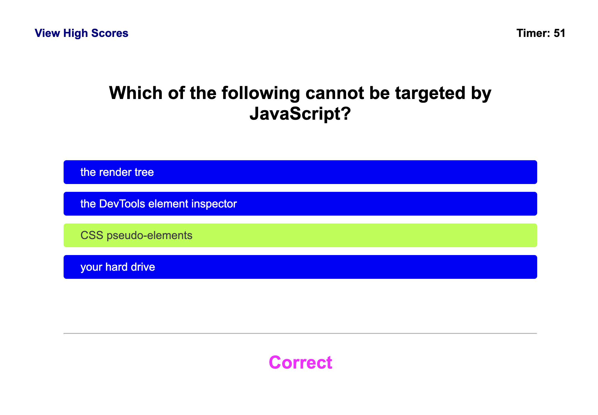

# Web APIs: Code Quiz

Web APIs: Code Quiz

## My Task

For this challenge, I built a timed coding quiz with multiple-choice questions. This app runs in the browser and features dynamically updated HTML and CSS powered by JavaScript code, with a clean, polished, and responsive user interface.

## Screenshots

## Link To Deployed Application
https://bonniefaucett.github.io/challenge-04/